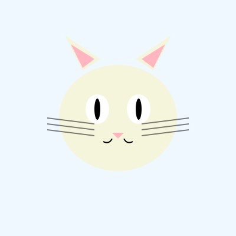

# � ForkCat

> **Your digital cat that lives forever on GitHub and evolves with AI**

ForkCat is an autonomous, self-evolving digital collectible that combines:
- 🎮 **Tamagotchi-style** digital pets
- 🎨 **CryptoKitties** genetic breeding
- � **Collectible** unique traits
- 🤖 **AI-powered** daily evolution

## What is ForkCat?

Each ForkCat is a unique digital creature that:
- **Lives on GitHub** as a repository
- **Evolves daily** through AI-powered mutations
- **Changes appearance** based on its DNA
- **Breeds through forks** - create new generations
- **Grows a family tree** across the GitHub network

### The Magic

1. **Your Cat**: The owner of the GitHub repo owns the cat
2. **Fork to Breed**: Fork the repo to create a kitten with inherited + mutated traits
3. **AI Evolution**: Every day, an AI agent slightly modifies your cat's appearance
4. **Secret DNA**: Cat traits are stored as GitHub Secrets (only you can see them)
5. **Public Art**: The cat's visual representation updates daily in the README
6. **Network Effect**: All cats form a family tree across GitHub

## How It Works

```
Day 1: � Born with random DNA
Day 2: � AI mutates color slightly
Day 3: � Grows a bow
Day 4: � Expression changes
...
Day 365: � Completely unique creature

Fork it: � Kitten inherits 50% parent DNA + 50% random + daily mutations
```

## Features

### 🧬 Genetics System
- **DNA Traits**: Color, size, accessories, expressions, patterns
- **Inheritance**: Kittens inherit traits from parents with mutations
- **Rarity System**: Some traits are rarer than others
- **Generation Tracking**: Know your cat's lineage

### ✨ Free AI Evolution
ForkCat now uses **GitHub Models** (gpt-4o) by default for **free** AI-powered evolution! No API key required.

(Optional: You can still use Claude by setting `ANTHROPIC_API_KEY` and `AI_PROVIDER=claude`)

- **Daily Mutations**: AI subtly evolves your cat
- **Smart Changes**: AI understands aesthetics and makes coherent changes
- **Personality Development**: Cats develop unique personalities over time

### 🎨 Visual System
- **SVG Generation**: Procedurally generated cat art
- **Real-time Updates**: README shows current cat state
- **History Tracking**: See how your cat evolved over time

### 🌳 Network
- **Family Trees**: Visualize cat genealogy
- **Rarity Rankings**: See the rarest cats in the network
- **Discovery**: Find and follow other cats

## Quick Start

### 1. Fork the Repository
Click the **"Fork"** button (top right) to create your own cat repository.

### 2. Enable GitHub Actions
Go to the **Actions** tab in your new repository and click **"I understand my workflows, go ahead and enable them"**.

### 3. Run Genesis Workflow
1. Go to **Actions** tab
2. Select **"Initialize New Cat"** from the left sidebar
3. Click **"Run workflow"** (blue button)
4. Wait for it to complete - your cat is being born! �

### 4. Enable Daily Evolution
1. In the **Actions** tab, select **"Daily Evolution"**
2. You'll see a banner saying "This workflow has a schedule that is disabled in forked repositories"
3. Click **"Enable workflow"** to let your cat evolve every day!

### 5. Enable GitHub Pages
1. Go to **Settings** → **Pages**
2. Under "Build and deployment" > "Source", ensure **GitHub Actions** is selected
3. Your cat will be live at `https://<username>.github.io/<repo-name>/`

### 6. (Optional) Configure AI
By default, ForkCat uses **GitHub Models (gpt-4o)** which is **FREE**!

If you prefer to use Claude:
1. Go to **Settings** → **Secrets and variables** → **Actions**
2. Add a new secret: `ANTHROPIC_API_KEY`
3. Add a variable: `AI_PROVIDER` = `claude`

## Your Cat

<!-- CAT_DISPLAY_START -->
<div align="center">



</div>
<!-- CAT_DISPLAY_END -->

## Cat Stats

<!-- CAT_STATS_START -->
- **Generation**: 1
- **Age**: 34 days
- **Mutations**: 3
- **Rarity Score**: 28.3/100
<!-- CAT_STATS_END -->

## Family Tree

<!-- CAT_FAMILY_START -->
*Fork this repo to create kittens!*
<!-- CAT_FAMILY_END -->

## Development

### Local Setup

```bash
# Install dependencies
pip install -r requirements.txt

# Initialize your cat
python src/cli.py init

# View in web interface
./start_web.sh

# Evolve cat manually
python src/cli.py evolve --ai

# Show cat stats
python src/cli.py show

# Run tests
pytest tests/
```

### Project Structure

```
forkCat/
├── .github/
│   └── workflows/
│       ├── daily-evolution.yml    # Daily AI evolution
│       ├── deploy-pages.yml       # Deploy to GitHub Pages
│       └── on-create.yml          # Initialize new cat (template/fork)
├── src/
│   ├── genetics.py                # DNA and trait system
│   ├── evolution.py               # AI-powered evolution
│   ├── visualizer.py              # SVG cat generator
│   ├── storage.py                 # Data persistence
│   └── cli.py                     # Command-line interface
├── web/
│   ├── index.html                 # Web interface
│   ├── style.css                  # Modern blocky design
│   ├── script.js                  # Interactive features
│   └── serve.py                   # Local web server
├── tests/                         # Comprehensive tests
├── cat_data/
│   ├── dna.json                   # Cat DNA
│   ├── history.json               # Evolution history
│   ├── stats.json                 # Cat statistics
│   └── cat.svg                    # Visual representation
└── README.md                      # This file (auto-updated)
```

## How to Breed

1. **Fork this repository** - Creates a kitten
2. **Enable Actions** - Go to Actions tab and enable workflows
3. **Run Genesis** - Run "Initialize New Cat" workflow
4. **Kitten inherits traits** - 50% from parent, 50% random
5. **Watch it grow** - Evolving daily with free AI!

## Rarity System

Traits have different rarity levels:
- **Common** (60%): Basic colors, simple patterns
- **Uncommon** (25%): Special colors, accessories
- **Rare** (10%): Unique patterns, special features
- **Legendary** (5%): Ultra-rare combinations

## Network Stats

<!-- NETWORK_STATS_START -->
- **Total Cats**: Calculating...
- **Generations**: Calculating...
- **Rarest Trait**: Calculating...
<!-- NETWORK_STATS_END -->

## API

### View Your Cat's DNA
```bash
# DNA is stored in GitHub Secrets (private)
# Only the owner can see the full DNA
```

### Get Cat Stats
```bash
curl https://api.github.com/repos/{owner}/forkCat/contents/cat_data/stats.json
```

### View Family Tree
```bash
python src/cli.py family-tree
```

## Contributing

Want to improve ForkCat?
1. Fork this repo
2. Create a feature branch
3. Make your changes
4. Submit a PR to the main ForkCat repo

## Inspiration

- 🎮 **Tamagotchi**: Virtual pets that need care
- 🐱 **CryptoKitties**: Genetic breeding on blockchain
- 🌱 **Seed-GPT**: AI-powered autonomous growth

## License

MIT License - Fork, breed, and evolve freely!

It's all free, public and uses free mechanism of Github.

---

**Your cat is unique. Your cat is alive. Your cat is forever on GitHub.** �✨
